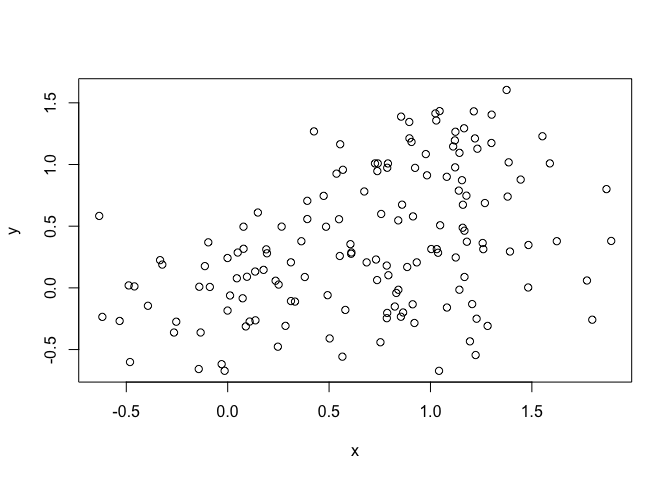
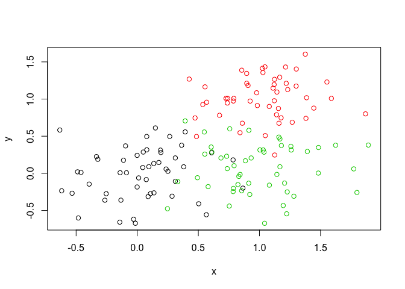
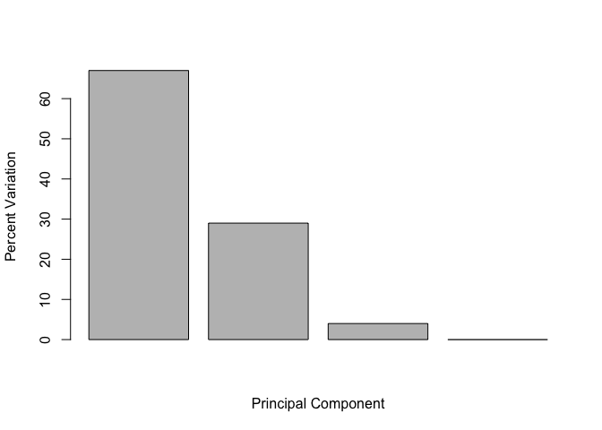

Unsupervised Machine Learning
================
Ji Sun Chin
2/4/2020

## K-means clustering

The main k-means function in R is `kmeans()`

``` r
#Create sample data and plot 
tmp <- c(rnorm(30,-3), rnorm(30,3)) #rnorm produces data following normal dist. Call for 30 values centered at -3 and 3 respectively
x <- cbind(x=tmp, y=rev(tmp)) #cbind combines vectors by column; rev() reverses dataset
plot(x)
#use kmeans function to find clusters for sample data x. Number of clusters set to 2 and 20 iterations of kmeans algorithm requested.
km <- kmeans(x, centers=2, nstart=20)
km
```

    ## K-means clustering with 2 clusters of sizes 30, 30
    ## 
    ## Cluster means:
    ##           x         y
    ## 1  3.186401 -3.094310
    ## 2 -3.094310  3.186401
    ## 
    ## Clustering vector:
    ##  [1] 2 2 2 2 2 2 2 2 2 2 2 2 2 2 2 2 2 2 2 2 2 2 2 2 2 2 2 2 2 2 1 1 1 1 1 1 1 1
    ## [39] 1 1 1 1 1 1 1 1 1 1 1 1 1 1 1 1 1 1 1 1 1 1
    ## 
    ## Within cluster sum of squares by cluster:
    ## [1] 70.85037 70.85037
    ##  (between_SS / total_SS =  89.3 %)
    ## 
    ## Available components:
    ## 
    ## [1] "cluster"      "centers"      "totss"        "withinss"     "tot.withinss"
    ## [6] "betweenss"    "size"         "iter"         "ifault"

``` r
plot(x,)
```

<!-- -->

``` r
length(km$cluster)
```

    ## [1] 60

``` r
table(km$cluster)
```

    ## 
    ##  1  2 
    ## 30 30

``` r
km$centers
```

    ##           x         y
    ## 1  3.186401 -3.094310
    ## 2 -3.094310  3.186401

``` r
plot(x, col=km$cluster) #plots clusters with different colors
points(km$centers, col="blue", pch=15, cex=3)#km$centers calls coordinates of the cluster centers of km and displays them as large blue squares on the above plot.
```

<!-- -->

\#\#Heirarchical Clustering

The main Hierarchical clustering function in R is called `hclust()` An
important point here is that you have to calculate the distance matrix
from your input data before calling `hclust()`

For this we will use the `dist()` function first

``` r
# First we need to calculate point (dis)similarity
# as the Euclidean distance between observations
d <- dist(x)
# The hclust() function returns a hierarchical
# clustering model
hc <- hclust(d)
# the print method is not so useful here
```

``` r
plot(hc) #draws dendrogram
abline(h=6, col="red", lty=2) #draws a dashed red line at specified height
```

<!-- -->

To get cluster membership vector, I need to “cut” the tree at a certain
height to yield my seperate cluster
    branches

``` r
cutree(hc, h=6) # Cut by height h and returns clusters
```

    ##  [1] 1 1 1 1 1 1 1 1 1 1 1 1 1 1 1 1 1 1 1 1 1 1 1 1 1 1 1 1 1 1 2 2 2 2 2 2 2 2
    ## [39] 2 2 2 2 2 2 2 2 2 2 2 2 2 2 2 2 2 2 2 2 2 2

``` r
cutree(hc, k=6) #can also specify number of clusters by using k=
```

    ##  [1] 1 2 2 2 1 1 1 2 2 2 1 1 3 1 2 3 2 1 3 2 1 1 1 1 2 3 1 1 2 1 4 5 4 4 6 5 4 4
    ## [39] 4 4 5 6 4 5 6 5 4 6 4 4 5 5 5 4 4 4 5 5 5 4

``` r
# Using different hierarchical clustering methods
hc.complete <- hclust(d, method="complete")
hc.average <- hclust(d, method="average")
hc.single <- hclust(d, method="single")
```

Now try for some more realistic data

``` r
# Step 1. Generate some example data for clustering
x <- rbind(
matrix(rnorm(100, mean=0, sd = 0.3), ncol = 2), # c1
matrix(rnorm(100, mean = 1, sd = 0.3), ncol = 2), # c2
matrix(c(rnorm(50, mean = 1, sd = 0.3), # c3
rnorm(50, mean = 0, sd = 0.3)), ncol = 2))
colnames(x) <- c("x", "y")
# Step 2. Plot the data without clustering
plot(x)
```

<!-- -->

``` r
# Step 3. Generate colors for known clusters
# (just so we can compare to hclust results)
col <- as.factor( rep(c("c1","c2","c3"), each=50) )
plot(x, col=col)
```

<!-- -->

``` r
hc <- hclust(dist(x))
plot(hc)
abline(h=2, col="red", lty=2)
```

<!-- -->

``` r
cluster2 <- cutree(hc, h=2) #to get cluster membership vector
table(cluster2)# to see how many points in each cluster
```

    ## cluster2
    ##  1  2  3 
    ## 40 71 39

``` r
cluster3 <- cutree(hc, k=3)# can also do by specifying k
plot(x, col=cluster2) #can plot clusters now using different colors for each cluster
plot(x, col=cluster3)
```

<!-- -->

\#\#PCA of UK food
data

``` r
x <- read.csv("UK_foods.csv", row.names = 1) #row.names sets proper row names to info in 1st column of dataset
str(x)
```

    ## 'data.frame':    17 obs. of  4 variables:
    ##  $ England  : int  105 245 685 147 193 156 720 253 488 198 ...
    ##  $ Wales    : int  103 227 803 160 235 175 874 265 570 203 ...
    ##  $ Scotland : int  103 242 750 122 184 147 566 171 418 220 ...
    ##  $ N.Ireland: int  66 267 586 93 209 139 1033 143 355 187 ...

``` r
head(x)
```

    ##                England Wales Scotland N.Ireland
    ## Cheese             105   103      103        66
    ## Carcass_meat       245   227      242       267
    ## Other_meat         685   803      750       586
    ## Fish               147   160      122        93
    ## Fats_and_oils      193   235      184       209
    ## Sugars             156   175      147       139

``` r
barplot(as.matrix(x), beside=T, col=rainbow(nrow(x)))
```

<!-- -->

``` r
pairs(x, col=rainbow(10), pch=16) #Displays pairwise plots for each combination of countries and correlation in their respective data
```

<!-- -->

Principal Componenet Analysis(PCA) with the `prcomp()` function.

``` r
pca <- prcomp( t(x) )#t() takes transpose of data; switches x and y
summary(pca)
```

    ## Importance of components:
    ##                             PC1      PC2      PC3       PC4
    ## Standard deviation     324.1502 212.7478 73.87622 4.189e-14
    ## Proportion of Variance   0.6744   0.2905  0.03503 0.000e+00
    ## Cumulative Proportion    0.6744   0.9650  1.00000 1.000e+00

``` r
plot(pca$x[,1], pca$x[,2], xlab="PC1", ylab="PC2", xlim=c(-270,500))
text(pca$x[,1], pca$x[,2], colnames(x), col=1:4)
```

<!-- -->

``` r
v <- round( pca$sdev^2/sum(pca$sdev^2) * 100 )
barplot(v, xlab="Principal Component", ylab="Percent Variation")
```

<!-- -->

``` r
par(mar=c(10, 3, 0.35, 0))
barplot( pca$rotation[,1], las=2 )
```

<!-- -->

``` r
barplot( pca$rotation[,2], las=2 )
```

<!-- -->

``` r
biplot(pca)
```

<!-- -->
